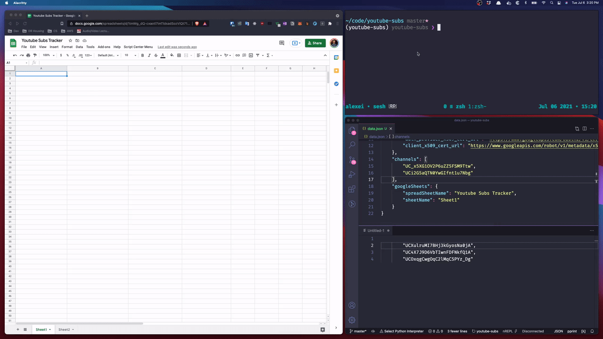

# Introduction

This is a script which when given a list of YouTube channel IDs will insert each channel IDs current subscriber count into a new row.

This script runs on AWS Lambda and is triggered periodically.

# Setup

## Create AWS Account

1. Sign up: https://aws.amazon.com/resources/create-account/
2. Setup AWS CLI: https://docs.aws.amazon.com/cli/latest/userguide/cli-chap-welcome.html

## Setup Python

1. Install pipenv: https://github.com/pypa/pipenv
2. Install pyenv-virtualenv: https://github.com/pyenv/pyenv-virtualenv#pyenv-virtualenv

## Setup Serverless Framework

1. Install serverless: https://www.serverless.com/framework/docs/getting-started/

## Create a new Google Project

1. Create a new Google Clould Platform project (e.g "Youtube-Subs"): https://console.cloud.google.com/apis/dashboard
2. Search for "Youtube Data API v3", "Google Drive API" and "Google Sheets API" and individually "Enable" each API for the project
3. Create "Service Account" credentials as mentioned: https://docs.gspread.org/en/v3.7.0/oauth2.html#enable-api-access-for-a-project

## Create new Google Sheets

1. Create a new Google Spreadsheet
2. Hit "Share" on the new spreadsheet and add the "client_email" value email specified in the Google service account credentials file previously generated above

# Configuration and Deployment

1. Create a `data.json` from `data.example.json`
    - `creds` values should come from the service account credentions JSON file
    - *Ensure the `private_key` string is double escaped for deployments*
        - Find the `\n` and replace with `\\n`
    - Place a list of channel ids in the `channels` array
    - Provide the name of your `spreadSheetName` and the `sheetName`
2. Edit `serverless.yml` accordingly, you can edit the `rate` to your liking (default is 1 minute)
3. Run `sls deploy`
4. Verify deployment: https://console.aws.amazon.com/lambda/home?region=us-east-1#/functions

# Testing

1. Have the `data.json` file created like in the deployment section
    - *Except, this time have the `private_key` string single escaped*
        - Find the `\\n` and replace with `\n`
2. Run local Python code `sls invoke local --function youtube-subs --path data.json`
3. Or, run currently deployed code `sls invoke --function youtube-subs --path data.json`